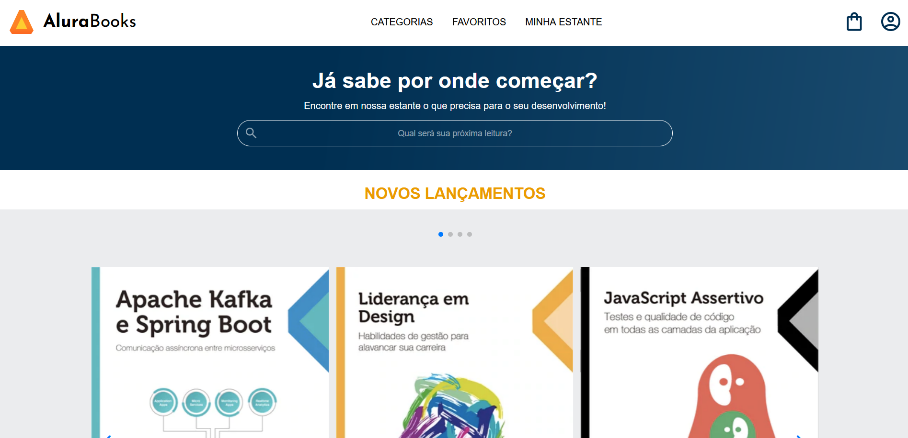

## 📸Imagem do projeto

  

## 🖥️Sobre o projeto
Esse é um projeto de uma página de livros da Alura, foi baseado em um <a href="https://www.figma.com/file/sSMbIqKaGBd66Y8roxTk2p/AluraBooks-%7C-Responsividade-com-Mobile-First?type=design&node-id=37-94&mode=design&t=Lh6njJLcFmdYBDXv-0">modelo do figma</a> disponibilizado pela Alura.

## 🚀Tecnologias utilizadas
Esse projeto foi desenvolvido durante o curso de HTML e CSS da Alura com as seguintes tecnologias: 
-HTML 
-CSS 
-JavaScript 
-Figma 
-Git e GitHub
